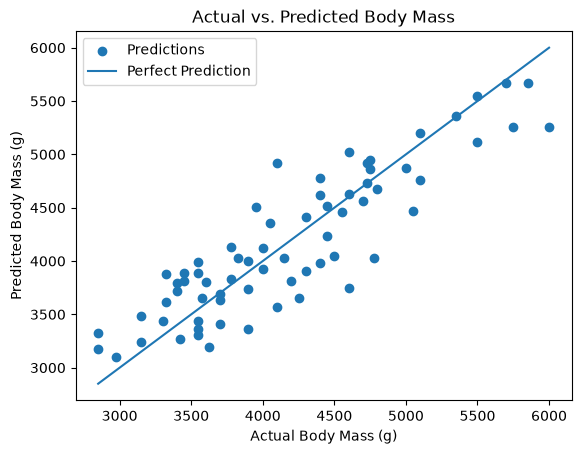

# Predicting Penguin Body Mass

This project explores linear regression and predictive analysis using the
Palmer Penguins dataset. The goal was to determine how well physical
measurements can be used to predict a penguin's body mass.

## Research Question

How well can bill depth, bill length, and flipper length predict body mass,
and does combining all three measurements improve prediction?

## Analysis

The target variable for this project is `body_mass_g`.

I first used simple linear regression to test three features individually:

- `bill_depth_mm`
- `bill_length_mm`
- `flipper_length_mm`

I used an 80/20 train/test split with a random seed of 42 and compared each
model with a baseline that predicted the mean body mass.

I then extended the analysis to multiple linear regression by combining all
three features in one model.

## Results

| Model | RMSE | R-squared |
| --- | ---: | ---: |
| Baseline | 751.68 | -0.002 |
| Bill depth | 668.28 | 0.208 |
| Bill length | 565.76 | 0.433 |
| Flipper length | 356.05 | 0.775 |
| Multiple regression | 349.98 | 0.783 |

Flipper length performed the best of the three individual features, with an
RMSE of 356.05 and an R-squared of 0.775.

The multiple regression model produced an RMSE of 349.98 and an R-squared
of 0.783. This was a large improvement over the baseline, but only a small
improvement over using flipper length alone.

## Model Visualizations

### Actual vs. Predicted Body Mass

